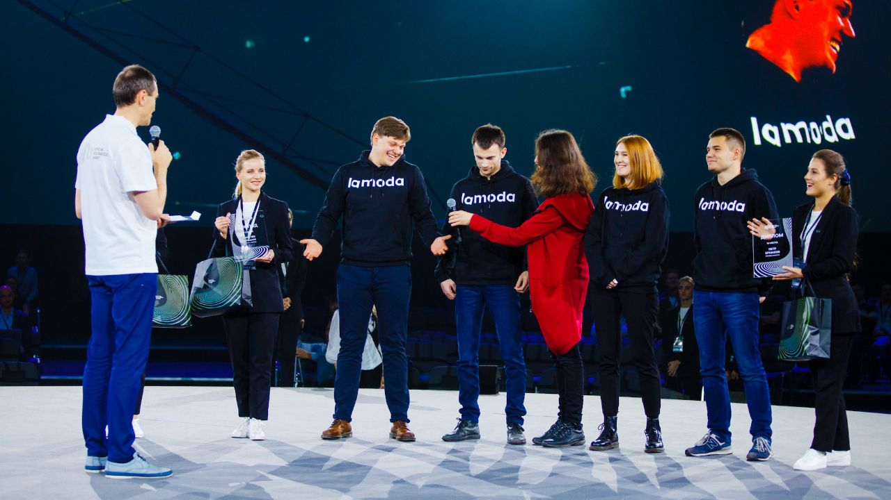

# Solving tasks for AI JOURNEY COMPETITION 2019
https://ai-journey.ru/en/competitions

The idea of the competition is to develop an algorithm that can successfully answer questions and pass Russian language examination test based on information from publicly available data sources.
Participants are provided with test examples that can be used for validation and model learning.
Competition solutions are sent to the automatic testing system and evaluated on the hidden set of questions.

I took part in this competition with my Lamoda сolleagues Aleksandr Zhelubenkov, Evgeny Mashkin and Petr Ermakov. Together we took tenth place. We had really good test solvers, but but we didn’t have enough time to deal with plagiarism in essay templates.

This repo is for some of my solvers for tests.

